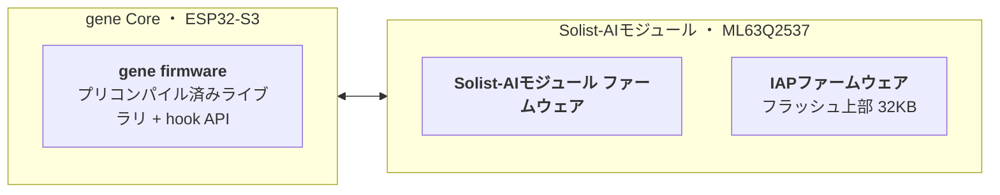

    
  <strong>P-BAN R&D Team</strong> 
  株式会社ピーバンドットコム（p-ban.com Corp.）

---

  プリント基板ネット通販サイト「P板.com（ピーバンドットコム）」の運営を中心に、 
  設計・製造・部品実装までをインターネット上でワンストップ提供するサービスを展開。

---

  <a href="https://www.p-ban.com/">P板.com</a> ·
  <a href="https://www.p-ban.com/services/gene/">gene</a> ·
  <a href="https://www.p-ban.com/services/gene/solist-ai.html">Solist-AI™ × gene 開発キット</a>

---

# gene

> そのセンサ、geneが動かす。

  

geneは、回路図とBOM（部品表）を渡すだけで、基板設計・製造からファームウェア・PCアプリまでをワンストップで仕上げる、センサーPoC特化のセミカスタム開発サービスです。

[センサPoCのセミカスタム開発サービス gene | P板.com](https://www.p-ban.com/services/gene/)

# Solist-AI™ × gene｜ノーコード組み込みAI開発キット

> 箱を開けたら、その日からAIを試せる。

  

ROHM Solist-AI™ を搭載した gene 開発キット。コードを書かずに、IC上で「学習→推論」まで。ファームウェア実装もモデル変換も専任エンジニアも不要。必要なのは、データとアイデアだけ。

[Solist-AI™ × gene｜ノーコード組み込みAI開発キット | P板.com](https://www.p-ban.com/services/gene/solist-ai.html)

# ファームウェアについて

### ファームウェアの構成

  

###  入手先

| ファームウェア | 提供方法 | |
| --- | --- | --- |
| gene firmware | プリコンパイル済みライブラリ + hook API のSDK | [gene_firmware_for_solist_ai_dev_kit](https://github.com/pban-rd-dev/gene_firmware_for_solist_ai_dev_kit/settings) |
| Solist-AIモジュール ファームウェア | バイナリ（Releases） | [solist_ai_module_firmware](https://github.com/pban-rd-dev/solist_ai_module_firmware) |
| Solist-AIモジュール IAPファームウェア | ソース | [solist_ai_iap_firmware](https://github.com/pban-rd-dev/solist_ai_iap_firmware) |

# GUI Application for dev kit

WIP

### 入手先

WIP

